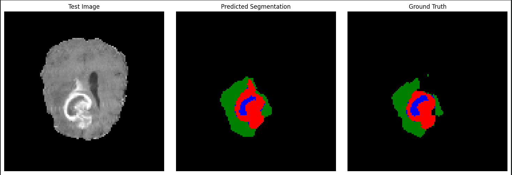

# Brain Tumor Image Segmentation
I've built and trained a U-Net model to perform image segmentation on brain MRI scans, able to detect different types of brain tumors.

Using a dataset from the Medical Decathlon Challenge, I built a convolutional neural network (CNN) based on the U-Net architecture, commonly used for segmentation tasks.

## Model Performance

| Metric                  | Class 1 | Class 2 | Class 3 | Class 4 | Overall Pixel Accuracy |
|-------------------------|---------|---------|---------|---------|------------------------|
| Dice Coefficient per class | 0.9956  | 0.6324  | 0.6125  | 0.7795  |                        |
| IoU Score per class     | 0.9913  | 0.4624  | 0.4414  | 0.6387  |                        |
| Pixel Accuracy          |         |         |         |         | 0.9892                 |
